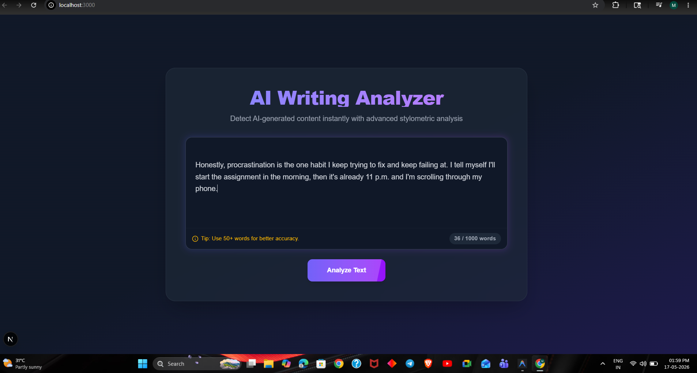

# AI Writing Analyzer




An end-to-end AI text analysis system built using FastAPI, Next.js, Machine Learning, and Supabase.

This project analyzes writing patterns and predicts whether a given text is likely AI-generated or human-written using stylometric and NLP-based feature engineering.

---

# Project Overview

The system was designed to study the difference between AI-generated and human-written text using statistical writing features instead of relying only on transformer classification models.

The project includes:

* Machine Learning model training pipeline
* NLP feature extraction system
* FastAPI backend for real-time inference
* Next.js frontend dashboard
* Supabase cloud database integration for feedback collection
* Deployment-ready backend architecture
* Docker-based backend setup

---

# Features

* Real-time AI vs Human text prediction
* Confidence score generation
* Stylometric feature analysis
* Feedback collection pipeline
* Cloud-based feedback storage using Supabase
* Modern responsive frontend UI
* REST API backend using FastAPI
* Docker-ready backend setup

---

# Machine Learning Features Used

The model analyzes multiple writing behavior patterns:

## 1. Perplexity

Measures how predictable or random the text is.

## 2. Burstiness

Measures variation in sentence structure and writing flow.

## 3. Average Sentence Length

Captures writing consistency and sentence construction style.

## 4. Vocabulary Diversity

Measures uniqueness of word usage inside the text.

---

# Tech Stack

## Frontend

* Next.js
* TypeScript
* Tailwind CSS
* Framer Motion

## Backend

* FastAPI
* Python
* Uvicorn

## Machine Learning / NLP

* Scikit-learn
* Transformers
* PyTorch
* Pandas
* NumPy
* Joblib

## Database

* Supabase PostgreSQL

## DevOps / Deployment

* Git
* Docker
* Hugging Face Spaces
* Render
* Vercel

---

# Project Architecture

```text
Frontend (Next.js)
        ↓
FastAPI Backend
        ↓
Feature Extraction Pipeline
        ↓
Machine Learning Model
        ↓
Prediction Response
        ↓
Supabase Feedback Storage
```

---

# Model Training Pipeline

The model was trained using manually engineered NLP features extracted from labeled AI-generated and human-written text samples.

Workflow:

1. Data Collection
2. Text Cleaning
3. Feature Engineering
4. Exploratory Data Analysis
5. Logistic Regression Training
6. Model Evaluation
7. Model Serialization using Joblib
8. API Integration

---

# Model Performance

Final model achieved strong classification performance on the evaluation dataset.

Example metrics achieved during experimentation:

* Accuracy: ~97%
* Precision: ~98%
* Recall: ~98%
* F1 Score: ~98%

Note:
Performance may vary depending on dataset quality and writing style distribution.

---

# Feedback Loop System

The application includes a feedback pipeline where users can mark predictions as:

* Actually Human
* Actually AI

The feedback data is stored in Supabase and can later be used for:

* Dataset expansion
* Model retraining
* Improving prediction robustness

---

# Deployment Notes

The project was prepared for cloud deployment using Docker and FastAPI.

During deployment experimentation:

* Render free tier faced memory limitations due to GPT2 and transformer dependencies.
* Hugging Face Spaces deployment was explored using Docker-based hosting.
* Backend architecture was separated into a standalone deployment service for production readiness.

Because of free-tier infrastructure limitations and heavy NLP dependencies, a fully public production deployment was not finalized.

However, the entire application is fully runnable locally.

---

# Running Locally

## 1. Clone Repository

```bash
git clone <repository-url>
cd project-folder
```

---

# Backend Setup

## 2. Navigate to Backend

```bash
cd backend
```

## 3. Create Virtual Environment

```bash
python -m venv venv
```

## 4. Activate Virtual Environment

### Windows

```bash
venv\Scripts\activate
```

### Linux / Mac

```bash
source venv/bin/activate
```

## 5. Install Dependencies

```bash
pip install -r requirements.txt
```

## 6. Configure Environment Variables

Create a `.env` file inside backend:

```env
SUPABASE_URL=your_supabase_url
SUPABASE_KEY=your_supabase_key
```

## 7. Run Backend

```bash
uvicorn main:app --reload
```

Backend runs on:

```text
http://127.0.0.1:8000
```

---

# Frontend Setup

## 8. Navigate to Frontend

```bash
cd frontend
```

## 9. Install Dependencies

```bash
npm install
```

## 10. Run Frontend

```bash
npm run dev
```

Frontend runs on:

```text
http://localhost:3000
```

---

# API Endpoints

## Analyze Text

```http
POST /analyze
```

Analyzes text and returns prediction with extracted features.

---

## Save Feedback

```http
POST /save_feedback
```

Stores user feedback into Supabase database.

---

# Challenges Faced

Some major engineering challenges during development:

* Transformer model memory usage during deployment
* Free-tier infrastructure limitations
* Managing Docker storage and container sizes
* Feature engineering consistency
* Cloud persistence design for feedback systems
* Backend deployment optimization

---

# Key Learnings

This project helped strengthen practical understanding of:

* NLP feature engineering
* Machine learning pipelines
* FastAPI backend development
* Full-stack ML application design
* Deployment workflows
* Docker fundamentals
* Cloud database integration
* Production architecture tradeoffs

---

# Future Improvements

Potential future upgrades:

* More robust datasets
* Additional stylometric features
* Advanced transformer-based classification
* User authentication
* Analytics dashboard
* Better deployment infrastructure
* Continuous retraining pipeline
* CI/CD automation

---

# Video Demo

[Watch the working video demo here](https://youtu.be/h2vZkYuTKjE?si=QZOnl0MRvlzIBLLY)

---

# Author

[Muhammed Shaheb](https://shahabzack.github.io/muhammed-shaheb-portfolio/)